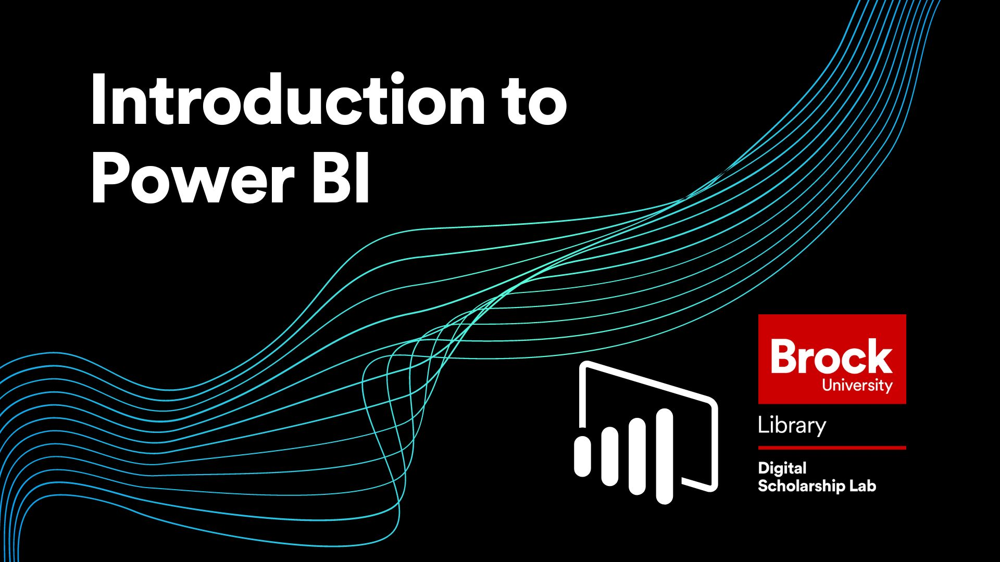

# Introduction to Power BI
This workshop will cover how to use the Power BI tool to gain some basic insights into our data and create visualizations that convey those insights.  Topics covered will include:

- Connecting your data to Power BI  
- Adjusting and understanding your data using the Power Query Editor  
- Connecting datasets using the Model view  
- 3 ways to make visualizations in the Report View  
- Formatting your visualizations  
  
----
## Setup Instructions
In preparation for this workshop, you will need to install Power BI Desktop on your computer.  Keep in mind that Power BI Desktop is **not Mac compatible** so if you want to participate in this workshop you will need to use a windows computer or set up a windows environment on your Mac computer.  
  
If you do not already have the program you can get it by following these steps (keep in mind that you may need to contact your institution for permission to install programs):

- Go to the [Power BI Desktop download page](https://www.microsoft.com/en-us/download/details.aspx?id=58494) and choose which language you prefer 
- Click the "Download" button and choose the installer that works for your computer  
- Once the download is complete, run the installer and follow the instructions in the setup wizard  
- With that you should be good to go!  

----
## Workshop Tasks

**Task Set #1**  
Link to first dataset:  

1. Open Power BI and connect to the dataset using the web connector  
2. Open the Power Query Editor using the "Transform Data" button  
3. Check that all of the data types are correct and fix any that are not  
4. Sort the data by product  
5. Find a potential error in the data.  Once you find one, let us know in the chat what it is and why it might have occured  
6. Undo your sort using the Applied Steps menu  
7. Calculate 2 new columns:   
 A column for Tax Paid (Sale Total*taxrate/(100+taxrate))  
 A column for Profit (Sale Total minus Tax Paid)  
8. Save your changes and close the editor.  Once you do this, type "SAVED" in the chat  

  
**Task Set #2**  
Link to second dataset:  

1. Connect to the new dataset
2. Check that all of the data types are correct using the Power Query Editor
3. Save and close the Power Query Editor and then go to the Model View
4. Disconnect the datasets and then reconnect them using Order Number
5. Once completed write "DATA CONNECTED!!!!" in the chat

  
**Task Set #3**  

1. Make a visualization showing Profit by Country by selecting the visualization type first then choosing the fields.  Add a filter so it only shows France and Canada  
2. Make a visualization showing Profit by Product by just selecting the fields.  If you don't like the default visualization type chosen by Power BI then select a different visualization type to change it (making sure the visualization is still selected)  
3. Make a visualization using the Q&A tool showing Tips by Country  
4. Make a visualization showing the Maximum Tip received from each Country  
5. Make a visualization showing the Average Satisfaction Rating by Country  
6. Try filtering your visualizations by each other.  If you hold down CTRL on your keyboard you can select multiple options  
7. When completed type "VISUALIZATIONS MASTERED!!!" in the chat  

**Task Set #4**  

1. Use the Format menu to adjust at least 3 features on one of your visualizations  
2. Use the Analytics menu to add a helpful feature to one of your visualizations.  Remember that different types of visualizations have different kinds of analytics that can be applied  
3. Once you are done type "WORKSHOP COMPLETED!!" in the chat  

----

## Follow Up Material
If you want to delve deeper into what Power BI is capable of, I recommend checking out the official [Power BI learning paths](https://docs.microsoft.com/en-us/learn/powerplatform/power-bi).  

 
 
 
----
  
**This workshop is brought to you by the Brock University Digital Scholarship Lab.  For a listing of our upcoming workshops go to [Experience BU](https://experiencebu.brocku.ca/organization/dsl) if you are a Brock affiliate or [Eventbrite page](https://www.eventbrite.ca/o/brock-university-digital-scholarship-lab-21661627350) for external attendees.**

